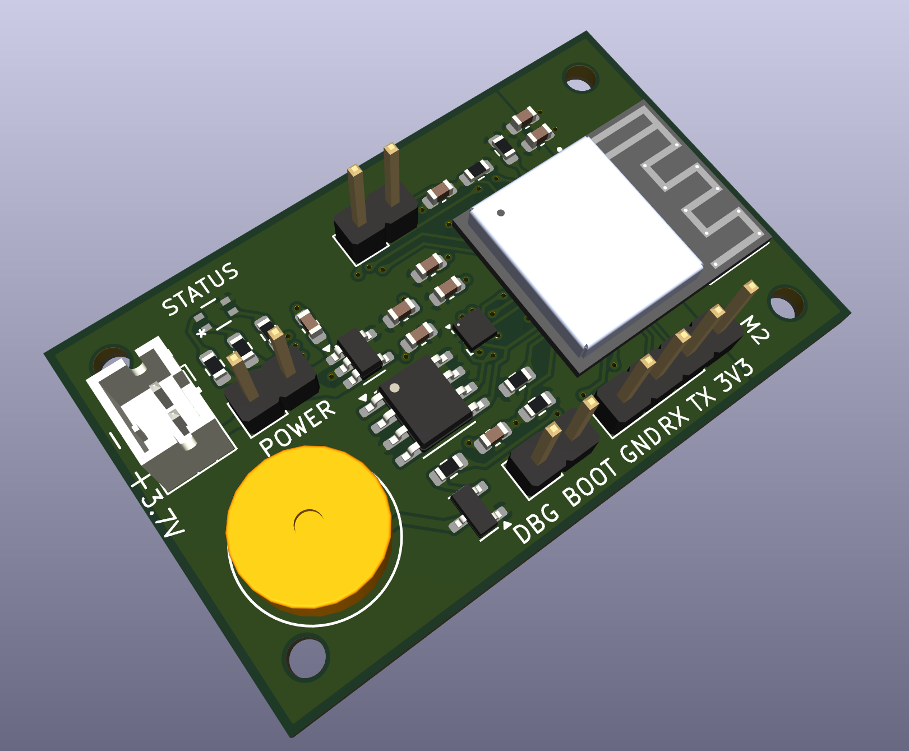
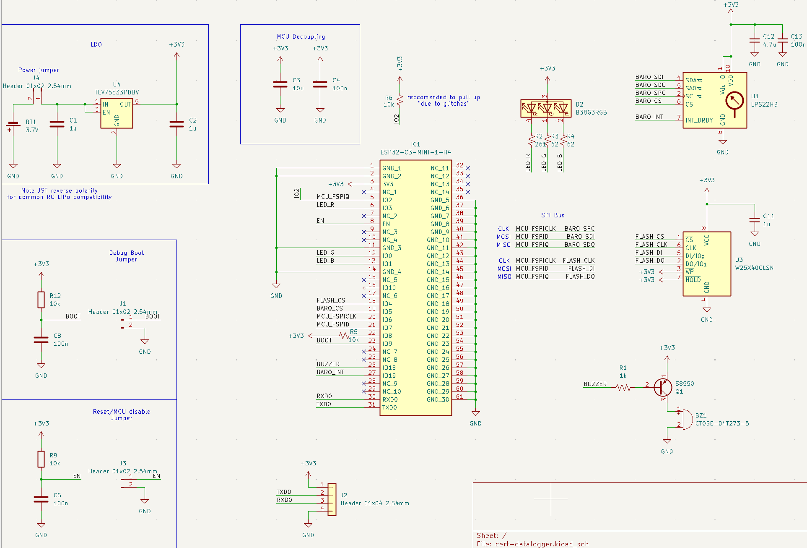
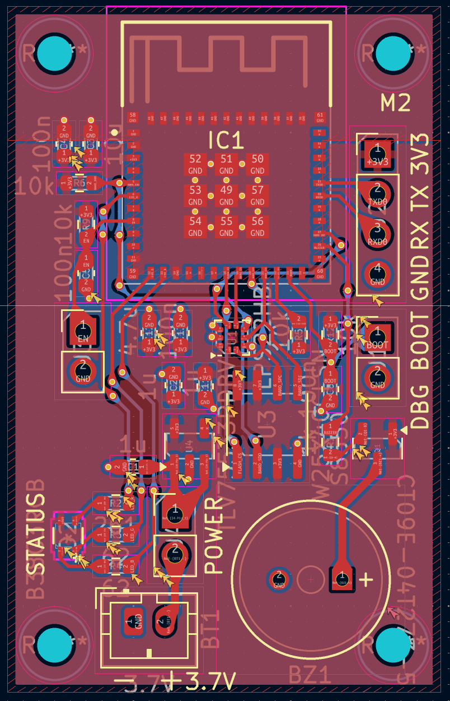

# cert-datalogger

Eggtimer Ion replica using ESP32-C3

## Features

- ESP32 MCU with WiFi and Bluetooth control and data export
- Pressure and temperature measurement
- 3.7V lithium battery compatibility
- Status LED and Buzzer

## Images

Screenshots for now:

